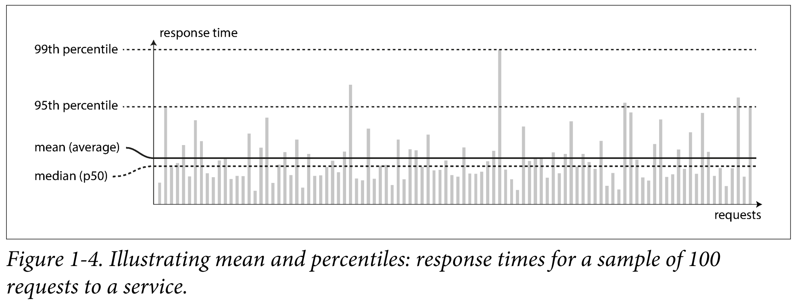
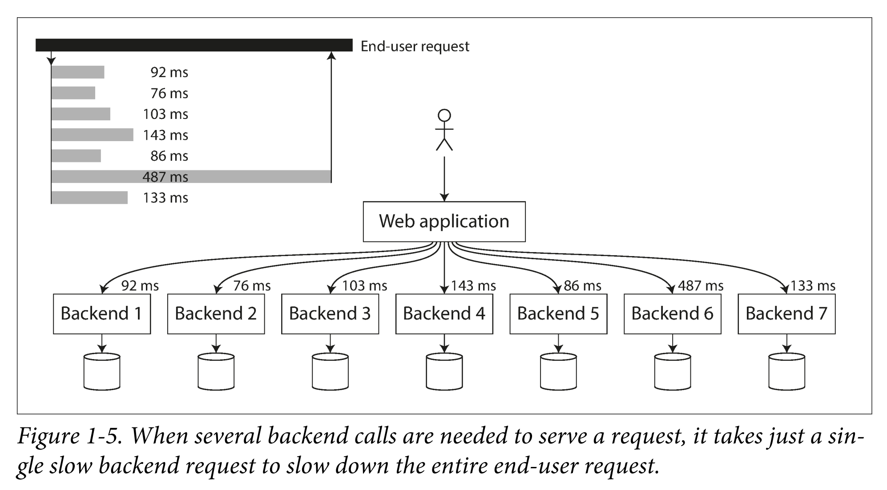

# Preface

## Preface
Driving forces in database developments and distributed systems:  
- Companies are handling massive amounts of traffic and data, so they must engineer tools to efficiently handle this
- To respond quickly to market insights, business must be able to test and iterate on hypotheses cheaply; thus, development cycles are short and data must be flexible to meet this dynamic environment
- (F)OSS preference and dependability is growing
- CPU clock speeds are barely increasing, but multi-core processors are standard and networks are getting faster 
- cloud infrastructure allows for distributed system across many machines and geographic regions
- extended downtime is increasnigly unacceptable

Data-Intensive applications: apps where data is the primary challenge, e.g. data quantity, complexity, and changes  

Compute-Intensive applications: apps where CPU cycles are the primary challenge  

Goals:  
- Understand successful data systems by examining their algorithms, their princicples, and trade-offs
- Be able to architect applications with appropriate technology by combining the most appropriate tools after examining their trade-offs

# Part 1: Foundations of Data Systems
- Chapter 1: Examines reliability, scalability, and maintainability and methods to achieve these goals
- Chapter 2: Compares data models and query langauges and discusses situations where each is most appropriate
- Chapter 3: Examines optimization of different work loads by reviewing the internals of storage engines and looks at how databases lay out data on disk 
- Chapter 4: Compares serialization formats and examines how they fare in scaling environments

## 1. Reliable, Scalable, and Maintainable Applications
  
Common Application Needs:  
- databases:  store data for finding/reading later
- caches:  remember the result of an operation, typically expensive, to be able to quickly return the data without having to retrieve from the database again
- search indexes:  allows searching by keywords or other filters
- stream processing:  deals with data in motion, sending data to another process, handled asynchronously
- batch processing:  collects and processes data in batches

### Thinking About Data Systems
Data Systems is an umbrella term used for optimized tools for data storage and processing.
Different tools, each performing a single task efficiently, are stitched together using application code because of the growing requirements from modern applications.  
The example below shows "an application-managed caching layer (using Memcached or similar), or a full-text search server (such as Elasticsearch or Solr) separate from your main database, it is normally the application code’s responsibility to keep those caches and indexes in sync with the main database."  
  
The above data system stitches together different tools using application code.  

**Questions when designing a data system:**  
- How do you ensure that the data remains correct and complete, even when things go wrong internally?  
- How do you provide consistently good performance to clients, even when parts of your system are degraded?  
- How do you scale to handle an increase in load?  
- What does a good API for the service look like?

**Concerns in Most Software Systems**  
- **Reliability:**  
The system should continue to work correctly (performing the correct function at the desired level of performance) even in the face of adversity (hardware or software faults, and even human error).  
- **Scalability:**  
As the system grows (in data volume, traffic volume, or complexity), there should be reasonable ways of dealing with that growth.  
- **Maintainability:**  
Over time, many different people will work on the system (engineering and operations, both maintaining current behavior and adapting the system to new use cases), and they should all be able to work on it productively
### Reliability  
**Software Reliability Principles**  
- application performs as the users expects
- it can tolerate unexpected user user or human errors
- it performs under expected load and data volume
- prevents abuse or unauthorized use of the application

Systems should be resilient or fault tolerant, i.e. they should continue to function even when faced with errors as they should be anticipating faults

fault vs. failure
- fault: one component of the system deviating from spec
- failure: system stops providing its service or function to users

#### Hardware Faults
Typical Faults: Hard disks crash, RAM becomes faulty, the power grid has a blackout, someone unplugs the wrong network cable  

Redundancy is typically the first line of defense - Due to parallelism in cloud instances, risk is diversified and can be loss-tolerant
#### Software Errors
**Systematic Errors:** Cause the most faults and are difficult to anticipate. e.g. "A software bug that causes every instance of an application server to crash when given a particular bad input. For example, consider the leap second on June 30, 2012, that caused many applications to hang simultaneously due to a bug in the Linux kernel"  
**Mitigations:** "carefully thinking about assumptions and interactions in the system; thorough testing; process isolation; allowing processes to crash and restart; measuring, monitoring, and analyzing system behavior in production."  

#### Human Errors
Tips for reliable systems tolerant to human errors, as quoted in DDIA:
- well-designed abstractions, APIs, and admin interfaces make it easy to do “the right thing” and discourage “the wrong thing.”
- provide fully featured non-production sandbox environments where people can explore and experiment safely, using real data, without affecting real users
- Test thoroughly at all levels, from unit tests to whole-system integration tests and manual tests
- make it fast to roll back configuration changes, roll out new code gradually, and provide tools to recompute data
- detailed and clear monitoring, such as performance metrics and error rates
#### How Important Is Reliability?
Business implications - "outages of ecommerce sites can have huge costs in terms of lost revenue and damage to reputation."
### Scalability
Scalability is the term we use to describe a system’s ability to cope with increase load
#### Describing Load
Load Parameters may be requests per second to a web server, the ratio of reads to writes in a database, the number of simultaneously active users in a chat room, the hit rate on a cache, or something else
#### Describing Performance
**Throughput** is the number of records we can process per second, or the total time it takes to run a job on a dataset of a certain size.  

Most important for an online system is the **response time**, being the time between a client sending a request and receiving a response. This can be affected by "a context switch to a background process, the loss of a network packet and TCP retransmission, a garbage collection pause, a page fault forcing a read from disk, mechanical vibrations in the server rack" etc.

The median, 50th percentile, is abbreviated as p50 where half of users requests are served in less than this time and the other half are served in more than this time. e.g. if p50 is 200ms then half of your users are served in less than 200ms and the other half is served in more than 200ms. This is seen in the 95th and 99th percentiles.  
Nevertheless, it is important to examine and address some of your outliers, but you must also consider the diminishing returns. i.e. optimizing to address p95 and p99 can have critical business effects, but p999 (99.9 percentile - e.g. 1 in 10,000) may have diminishing returns.  
*"Amazon has also observed that a 100 ms increase in response time reduces
sales by 1%"*

#### Approaches for Coping with Load
**scaling up** -  *vertical scaling*, moving to a more powerful machine. This is often simpler but more expensive.  
**scaling out** - *horizontal scaling*, distributing the load across multiple smaller machines. Distributing load across multiple machines is also
known as a *shared-nothing* architecture.
**elastic systems** - a more complex way of scaling systems with highly unpredictable load that automatically add computing resources when they detect a load increase

### Maintainability
**Maintainable Software**
- Operability: Ops should be able to keep system running smoothly
- Simplicity: barrier to entry to codebase should be low, i.e. new engineers should be able to hit the ground running
- Evolvability (modifiability, extensibility, plasticity): It should be easy for engineers to make changes to the codebase

#### Operability: Making Life Easy for Operations
**Ops Team Responsibility**  
- health monitoring
- performance and failure tracking and trouble shooting
- Keeping software up to date including security patches
- Examine effects of systems on each other
- anticipate future problems
- tools and practices for deployment and configuration management
- maintenance tasks such as migrating platforms
- maintaining security of the system
- keep production environment stable
- preserve organization knowledge about the system, e.g. documentation  
- Providing good documentation
- Self-healing where appropriate, but also giving administrators manual control over the system state when needed
#### Simplicity: Managing Complexity
simplicity yields maintainability  

#### Evolvability: Making Change Easy
"The ease with which you can modify a data system, and adapt it to changing requirements, is closely linked to its simplicity and its abstractions: simple and easy-tounderstand systems are usually easier to modify than complex ones. But since this is such an important idea, we will use a different word to refer to agility on a data system level: evolvability "
### Summary
Applications should meet:  

**functional requirements:** what it should do, such as allowing data to be stored, retrieved, searched, and processed in various ways  
**non-functional requirements:** general properties like security, reliability compliance, scalability, compatibility, and maintainability  
  
**Concerns in Most Software Systems**  
- **Reliability:**  
The system should continue to work correctly (performing the correct function at the desired level of performance) even in the face of adversity (hardware or software faults, and even human error).  
- **Scalability:**  
As the system grows (in data volume, traffic volume, or complexity), there should be reasonable ways of dealing with that growth.  
- **Maintainability:**  
Over time, many different people will work on the system (engineering and operations, both maintaining current behavior and adapting the system to new use cases), and they should all be able to work on it productively 
## 2. Data Models and Query Languages

